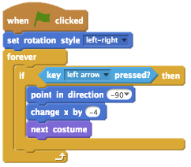
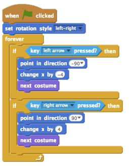

## Make Scratchy walk
Let’s start by creating code that will make Scratchy the Cat walk

+ Open the Moonhack 2017 Scratch project online at <a href="https://bit.ly/mh-scratch">bit.ly/mh-scratch</a>.

+ Let’s use the arrow keys to allow Scratchy to move from left to right on the screen. When the player presses the left arrow, you want Scratchy to move left, by changing its x coordinate. Add this code to the `Scratchy` sprite:

+ Test out your code by clicking the flag and then holding down the left arrow. Does Scratchy move to the left?

+ To move Scratchy to the right, you need to add another `if`{:class="blockcontrol"} block using the right arrow:

