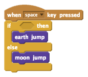
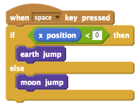

## Scratchy Jumps

Let’s create code that will make Scratchy jump depending on which planetary object he is on.

+ We are going to use the Spacebar key to make Scratchy jump. To start this process, add this code to the `Scratchy` sprite:

+ Test out your code. If it is not functioning the way we would like it to currently. That is because we need to add a `condition`{:class="blockoperators"} between the words “if” and “then” like the code below:

+ Test your code out by clicking the green flag and then jumping on both sides of the stage.

+ What is happening and how does the program know what side of the stage Scratchy the Cat is on?

**Congratulations!** You have completed the Moonhack Scratch project of 2017! Celebrate by jumping up and down yourself. Make sure they are Earth jumps though :)

Now that this project is done there are so many other things you can do. You can...

* Improve this project by completing the challenges below
* Have a go at the Moonhack Python project
* Create your own “Moon” themed project in Scratch, Python or HTML/CSS!

