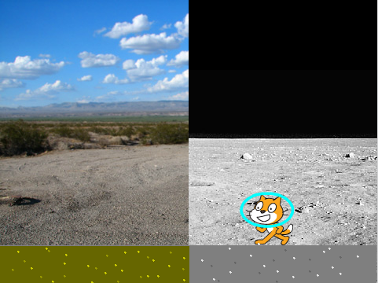

## Introduction

The Moon is about 27% the size of Earth. This size difference means that gravity on The Moon is much weaker than it is here on Earth. In order for astronauts to prepare for space travel, they need to understand what effect gravity has on the way they move around. Create a simulator that demonstrates how someone on The Moon can jump six times as high as you can on Earth! Not only that, you would be in the air four times as long when you jump. This is because the gravity on The Moon is much less strong than it is on Earth.

In this activity we are going to simulate the difference between jumping on The Moon compared to jumping on Earth.

Is this your first time using Scratch? [This guide](https://codeclubprojects.org/en-GB/resources/scratch-intro/) introduces the Scratch programming language.

  <iframe allowtransparency="true" width="485" height="402" src="https://scratch.mit.edu/projects/embed/160241020/?autostart=false" frameborder="0"></iframe>
  

### Additional information for club leaders

If you need to print this project, please use the [Printer friendly version](https://projects.raspberrypi.org/en/projects/moonhack-scratch/print).

## \--- collapse \---

## title: Project materials

## Club leader resources

* [Downloadable completed Scratch 2 project](resources/Moonhack17-Finished.sb2)

\--- /collapse \---