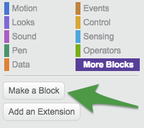
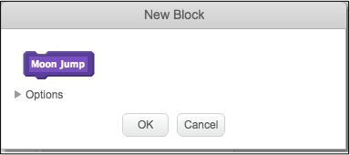
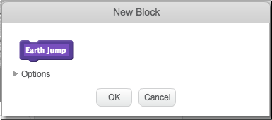
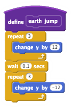
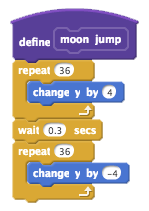

## Create Jumping Blocks

Let’s create our own blocks that will make Scratchy jump up and down

+ From the `More Blocks`{:class="blockmoreblocks"} category select “Make a Block”

+ Make two new blocks, name them “Earth Jump” and “Moon Jump”

 

+ First, we are going to create code that will allow Scratchy to jump on earth. To do this, add this code to the `Scratchy` sprite: 

+ Next, we are going to create code for Scratchy to jump on The Moon. To do this, add this code to the `Scratchy` sprite:

+ Great job! You now have new blocks that you created yourself. In step 3 we are going to create code to use these new blocks.